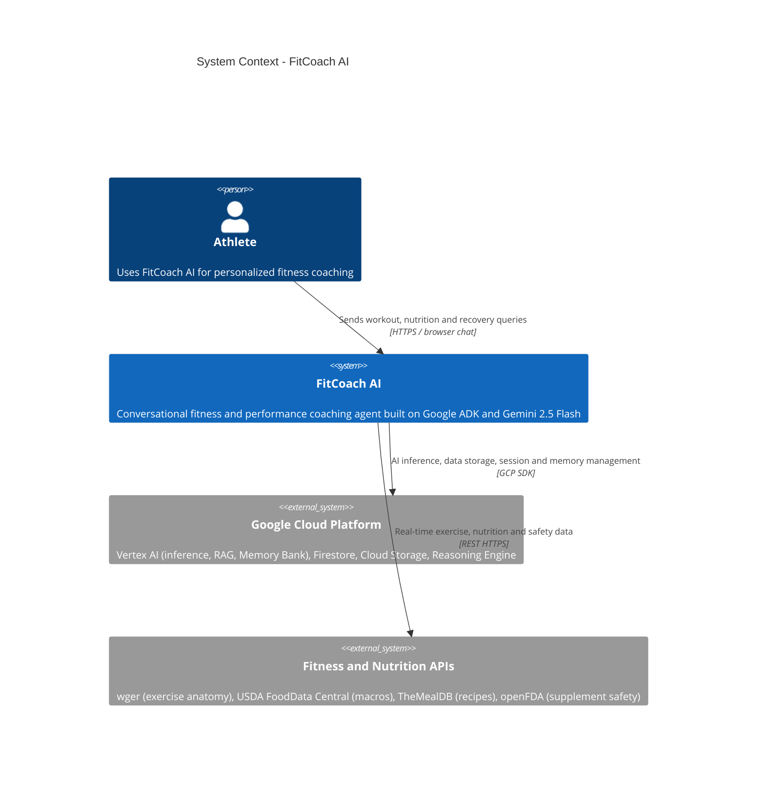
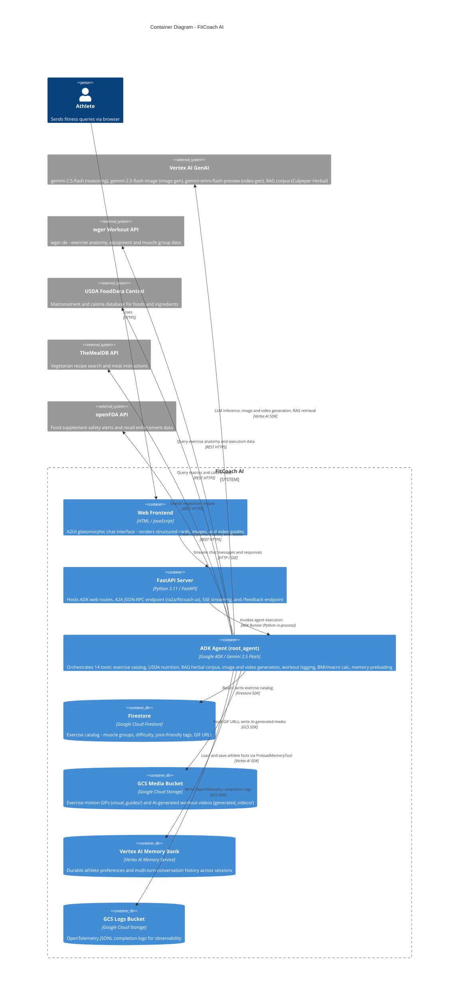
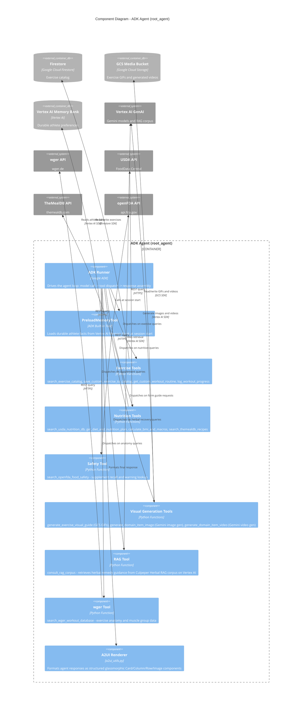

# FitCoach AI - Architecture Diagrams (C4 Model)

## Level 1 - System Context

```mermaid
C4Context
    title System Context - FitCoach AI

    Person(athlete, "Athlete", "Uses FitCoach AI for personalized fitness coaching")

    System(fitcoach, "FitCoach AI", "Conversational fitness and performance coaching agent built on Google ADK and Gemini 2.5 Flash")

    System_Ext(gcp, "Google Cloud Platform", "Vertex AI (inference, RAG, Memory Bank), Firestore, Cloud Storage, Reasoning Engine")
    System_Ext(fitness_apis, "Fitness and Nutrition APIs", "wger (exercise anatomy), USDA FoodData Central (macros), TheMealDB (recipes), openFDA (supplement safety)")

    Rel(athlete, fitcoach, "Sends workout, nutrition and recovery queries", "HTTPS / browser chat")
    Rel(fitcoach, gcp, "AI inference, data storage, session and memory management", "GCP SDK")
    Rel(fitcoach, fitness_apis, "Real-time exercise, nutrition and safety data", "REST HTTPS")
```

---

## Level 2 - Container Diagram

```mermaid
C4Container
    title Container Diagram - FitCoach AI

    Person(athlete, "Athlete", "Sends fitness queries via browser")

    System_Boundary(fitcoach_system, "FitCoach AI") {
        Container(frontend, "Web Frontend", "HTML / JavaScript", "A2UI glassmorphic chat interface - renders structured cards, images, and video guides")
        Container(fastapi, "FastAPI Server", "Python 3.11 / FastAPI", "Hosts ADK web routes, A2A JSON-RPC endpoint (/a2a/fitcoach-ai), SSE streaming, and /feedback endpoint")
        Container(agent, "ADK Agent (root_agent)", "Google ADK / Gemini 2.5 Flash", "Orchestrates 14 tools: exercise catalog, USDA nutrition, RAG herbal corpus, image and video generation, workout logging, BMI/macro calc, memory preloading")
        ContainerDb(firestore, "Firestore", "Google Cloud Firestore", "Exercise catalog - muscle groups, difficulty, joint-friendly tags, GIF URLs")
        ContainerDb(gcs_media, "GCS Media Bucket", "Google Cloud Storage", "Exercise motion GIFs (visual_guides/) and AI-generated workout videos (generated_videos/)")
        ContainerDb(memory_bank, "Vertex AI Memory Bank", "Vertex AI Memory Service", "Durable athlete preferences and multi-turn conversation history across sessions")
        ContainerDb(gcs_logs, "GCS Logs Bucket", "Google Cloud Storage", "OpenTelemetry JSONL completion logs for observability")
    }

    System_Ext(vertex_ai, "Vertex AI GenAI", "gemini-2.5-flash (reasoning), gemini-2.5-flash-image (image gen), gemini-omni-flash-preview (video gen), RAG corpus (Culpeper Herbal)")
    System_Ext(wger, "wger Workout API", "wger.de - exercise anatomy, equipment and muscle group data")
    System_Ext(usda, "USDA FoodData Central", "Macronutrient and calorie database for foods and ingredients")
    System_Ext(themealdb, "TheMealDB API", "Vegetarian recipe search and meal instructions")
    System_Ext(openfda, "openFDA API", "Food supplement safety alerts and recall enforcement data")

    Rel(athlete, frontend, "Uses", "HTTPS")
    Rel(frontend, fastapi, "Streams chat messages and responses", "HTTP / SSE")
    Rel(fastapi, agent, "Invokes agent execution", "ADK Runner (Python in-process)")
    Rel(agent, vertex_ai, "LLM inference, image and video generation, RAG retrieval", "Vertex AI SDK")
    Rel(agent, firestore, "Read / write exercise catalog", "Firestore SDK")
    Rel(agent, gcs_media, "Read GIF URLs, write AI-generated media", "GCS SDK")
    Rel(agent, memory_bank, "Load and save athlete facts via PreloadMemoryTool", "Vertex AI SDK")
    Rel(agent, gcs_logs, "Write OpenTelemetry completion logs", "GCS SDK")
    Rel(agent, wger, "Query exercise anatomy and execution data", "REST HTTPS")
    Rel(agent, usda, "Query macros and calorie data", "REST HTTPS")
    Rel(agent, themealdb, "Search vegetarian recipes", "REST HTTPS")
    Rel(agent, openfda, "Check supplement safety and recalls", "REST HTTPS")
```

---

## Level 3 - Component Diagram (ADK Agent internals)

```mermaid
C4Component
    title Component Diagram - ADK Agent (root_agent)

    Container_Boundary(agent_boundary, "ADK Agent (root_agent)") {
        Component(runner, "ADK Runner", "Google ADK", "Drives the agent loop: model call -> tool dispatch -> response assembly")
        Component(memory_tool, "PreloadMemoryTool", "ADK Built-in Tool", "Loads durable athlete facts from Vertex AI Memory Bank at session start")
        Component(exercise_tools, "Exercise Tools", "Python Functions", "search_exercise_catalog, save_custom_exercise_to_catalog, get_custom_workout_routine, log_workout_progress")
        Component(nutrition_tools, "Nutrition Tools", "Python Functions", "search_usda_nutrition_db, get_diet_and_nutrition_plan, calculate_bmi_and_macros, search_themealdb_recipes")
        Component(safety_tool, "Safety Tool", "Python Function", "search_openfda_food_safety - supplement recall and warning lookup")
        Component(visual_tools, "Visual Generation Tools", "Python Functions", "generate_exercise_visual_guide (GCS GIFs), generate_domain_item_image (Gemini image gen), generate_domain_item_video (Gemini video gen)")
        Component(rag_tool, "RAG Tool", "Python Function", "consult_rag_corpus - retrieves herbal remedy guidance from Culpeper Herbal RAG corpus on Vertex AI")
        Component(wger_tool, "wger Tool", "Python Function", "search_wger_workout_database - exercise anatomy and muscle group data")
        Component(a2ui, "A2UI Renderer", "a2ui_utils.py", "Formats agent responses as structured glassmorphic Card/Column/Row/Image components")
    }

    ContainerDb_Ext(firestore, "Firestore", "Google Cloud Firestore", "Exercise catalog")
    ContainerDb_Ext(gcs_media, "GCS Media Bucket", "Google Cloud Storage", "Exercise GIFs and generated videos")
    ContainerDb_Ext(memory_bank, "Vertex AI Memory Bank", "Vertex AI", "Durable athlete preferences")
    System_Ext(vertex_ai, "Vertex AI GenAI", "Gemini models and RAG corpus")
    System_Ext(wger, "wger API", "wger.de")
    System_Ext(usda, "USDA API", "FoodData Central")
    System_Ext(themealdb, "TheMealDB API", "themealdb.com")
    System_Ext(openfda, "openFDA API", "api.fda.gov")

    Rel(runner, memory_tool, "Calls at session start")
    Rel(runner, exercise_tools, "Dispatches on exercise queries")
    Rel(runner, nutrition_tools, "Dispatches on nutrition queries")
    Rel(runner, safety_tool, "Dispatches on supplement queries")
    Rel(runner, visual_tools, "Dispatches on form guide requests")
    Rel(runner, rag_tool, "Dispatches on herbal recovery queries")
    Rel(runner, wger_tool, "Dispatches on anatomy queries")
    Rel(runner, a2ui, "Formats final response")

    Rel(memory_tool, memory_bank, "Reads athlete facts", "Vertex AI SDK")
    Rel(exercise_tools, firestore, "Read/write exercises", "Firestore SDK")
    Rel(visual_tools, gcs_media, "Read/write GIFs and videos", "GCS SDK")
    Rel(visual_tools, vertex_ai, "Generate images and videos", "Vertex AI SDK")
    Rel(rag_tool, vertex_ai, "RAG retrieval", "Vertex AI SDK")
    Rel(wger_tool, wger, "REST query", "HTTPS")
    Rel(nutrition_tools, usda, "REST query", "HTTPS")
    Rel(nutrition_tools, themealdb, "REST query", "HTTPS")
    Rel(safety_tool, openfda, "REST query", "HTTPS")
```
